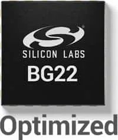
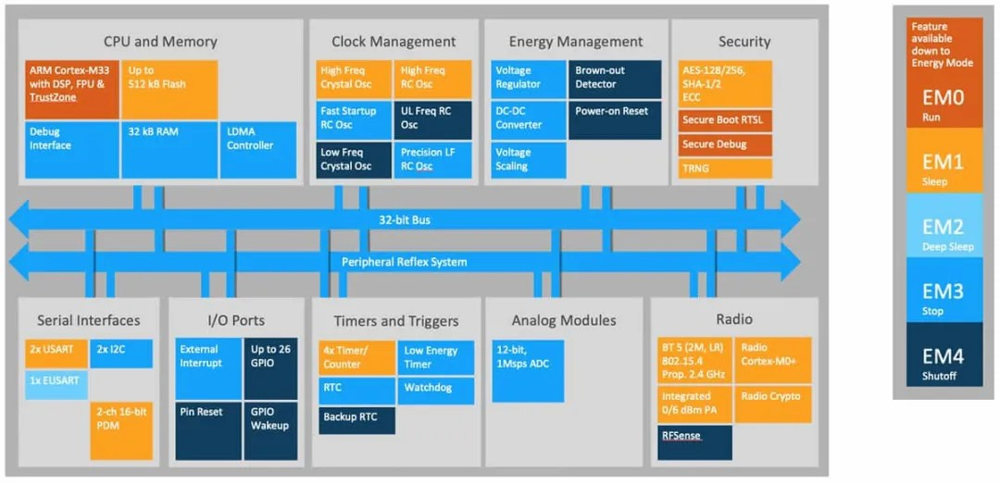

# 1. 硬件平台

**Thunderboard BG22蓝牙开发板**

Funpack 第四期活动板卡是一款 Silicon Labs（芯科科技）的 Thunderboard BG22 蓝牙开发套件。Silicon Labs 公司一直提供丰富的业内先进的无线连接产品，BG22 是今年推出的第二代蓝牙 SoC。蓝牙通信是短距离无线通信中增长最快的协议之一，其最大的优势是其低功耗特色。BG22 相对于之前 BG13 和 BG21 系列功耗更低，主要定位于电池供电带定位功能的极低功耗物联网应用。支持蓝牙 5.2 协议，更快的传输速度，更高精度和安全性，同时易于开发。

Silicon Labs 提供了芯片、模组、开发板到开发工具一系列评估验证工具，大大降低开发难度。今天带来的 Thunderboard BG22 就是一款适合程序开发功能验证的开发板，而且性价比很高，目前在 Digi-Key 只需要150元左右。

Thunderboard EFR32BG22 是基于 EFR32™ Wireless Gecko 片上系统的小型且经济高效、功能丰富的原型和开发平台。该开发板是开发节能型联网 IoT 设备的理想平台，适用于电池供电的蓝牙应用，板上集成了多个使用传感器芯片，提供的蓝牙 demo 程序可与连接云的智能手机应用程序一起使用，展示环境和运动传感器数据以及按钮和 LED 控制的便利集合。

开发板上有 USB Micro-B 电缆和板载 J-Link 调试器可以轻松完成 BG22 Thunderboard 的编程。USB 虚拟 COM 端口提供了到目标应用程序的串行连接，数据包跟踪接口 (PTI) 提供了有关无线链路中发送和接收的数据包的宝贵调试信息。板上包含一个8Mbit串行闪存，可用于无线(OTA)固件升级，或用作通用非易失性存储器。

**开发套件特性**

- Thunderboard 标准尺寸大小 4.5x3cm
- EFR32BG22 无线 Gecko SoC
  - 支持蓝牙 5.2，支持测向和 LE 编码 PHY
  - ARM Cortex-M33 内核，76.8MHz 的工作频率，512kB 闪存和 32kB RAM
  - 板载 38.4MHz 晶体
  - 板载 32.768 晶体
  - 2.4GHz 匹配网络和贴片天线

- 板载调试
  - 板载 Jlink 调试器，一路虚拟串口
  - USB Micro 连接器
  - Mini Simplicity 调试连接插座

- 板载可控的电源控制电路，实现传感器的超低功耗
- 一路用户按键和 LED
- 传感器
  - 相对湿度和温度传感器 Si7021
  - UV 和环境光传感器 Si1133
  - 霍尔效应传感器 Si7210
  - 6 轴惯性传感器 Invensense ICM-20648
- 8Mbit SPI Flash
- 20pin 2.54mm 通孔接口，用于 GPIO 访问和与外部硬件的连接
- 数据包跟踪接口 (PTI)
- USB 或纽扣电池供电
- 开源 Andriod 和 IOS demo 应用程序
- 软件开发平台 Simplicity Studio

**核心ER32BG22 SoC特性参数**

板上的EFR32BG22蓝牙低功耗5.2 SoC系列特性参数是为了满足大量电池供电蓝牙产品的独特要求，可提供低功耗蓝牙、网状网络和误差一米以内的测向精度。BG22 具有超低的发射和接收功率（0dBm下3.6mA发射，2.6mA接收）和高性能低功耗M33内核（工作时27µA/MHz，睡眠时1.2µA）– 业界领先的能效可以将纽扣电池寿命延长至五年以上。

- 无线
  - 蓝牙5.2
  - +6dBm发射
  - -106.7dBm接收 (125Kbps)
  - AoA和AoD

- 带TrustZone的Arm®Cortex®-M33
  - 工作频率76.8MHz
  - FPU和DSP
  - 352/512KB闪存
  - 32kB RAM

- 外设资源
  - 2个USART、2个I²C、2个PDM以及GPIO
  - 12位ADC（16通道）
  - 内置温度传感器，精度 +/-1.5°C
  - 32kHz 500ppm PLFRCO，无需晶体

- 超低功耗
  - 3.5mA TX（无线电）
  - 2.6mA RX（无线电）
  - 具有32kB RAM的1.4µA EM2
  - EM4模式使用RTC时耗电0.5µA

- 世界一流的软件
  - 蓝牙5.2
  - 蓝牙网状网络LPN
  - 测向
  - nApple HomeKit

- 安全
  - AES128/256, SHA-1, SHA-2（256位）
  - ECC（最高256 位）、ECDSA和ECDH
  - 真随机数生成器 (TRNG)
  - RTSL安全启动
  - 锁定/解锁功能，可安全调试

- 应用
  - 资产标签和信标
  - 消费电子遥控器
  - 便携式医疗设备
  - 蓝牙网状网络低功耗节点
  - 运动、健身和保健设备
  - 互联家居
  - 楼宇自动化和安全

## 1.1 概述

Silicon Labs 的 Thunderboard EFR32BG22 是基于 EFR32™ Wireless Gecko 片上系统的小型且经济高效、功能丰富的原型和开发平台。该开发板是开发节能型联网 IoT 设备的理想平台，适用于电池供电的蓝牙应用，并带有蓝牙 demo，该 demo 可与连接云的智能手机应用程序一起使用，展示环境和运动传感器数据以及按钮和 LED 控制的便利集合。

使用 USB Micro-B 电缆和板载 J-Link 调试器可以轻松完成 BG22 Thunderboard 的编程。USB 虚拟 COM 端口提供了到目标应用程序的串行连接，数据包跟踪接口（PTI）提供了有关无线链路中发送和接收的数据包的宝贵调试信息。板上包含一个 8Mbit 串行闪存，可用于无线（OTA）固件升级，或用作通用非易失性存储器。Simplicity Studio 支持 BG22 Thunderboard，并提供了一个板级支持包（BSP），为应用开发人员提供了一个良好的起点。

## 1.2 特性

开发套件特性：

- EFR32BG22 无线 Gecko SoC，具有76.8 MHz 的工作频率，512kB 闪存和32kB RAM
- 用于无线传输的2.4 GHz 陶瓷片式天线
- 板载外围设备的电源控制，可实现超低功耗运行
- 用户LED 和按钮
- 20引脚 2.54 mm 分支焊盘，用于 GPIO 访问和与外部硬件的连接
- SEGGER J-Link 板载调试器，易于编程和调试
- 虚拟 Com 端口
- 数据包跟踪接口 (PTI)
- Mini Simplicity 连接器，用于访问能量分析和高级无线网络调试
- 由USB或纽扣电池供电

